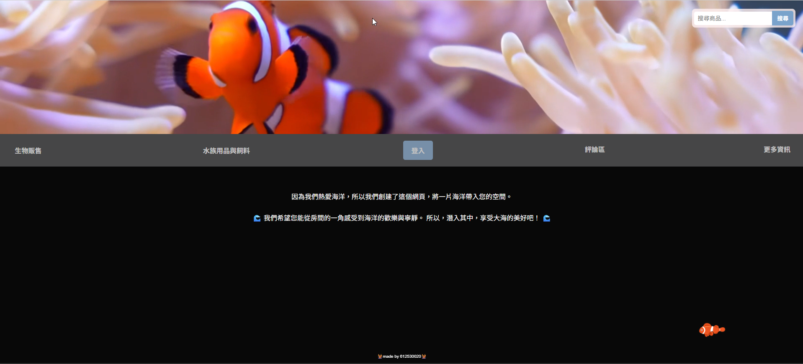
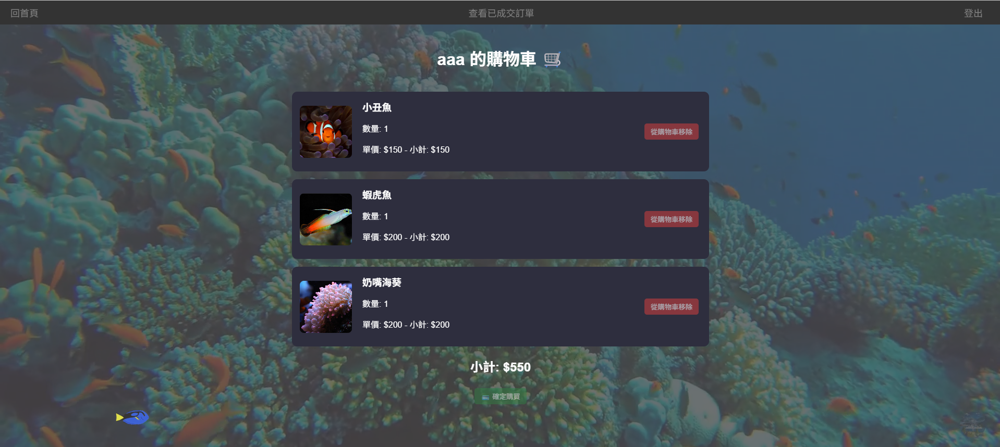
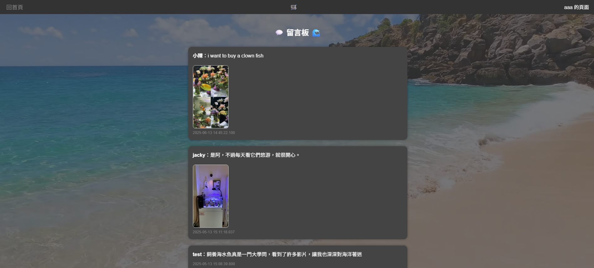

# 🌊 海水魚電商平台 - 全端 Web 專案

這是一個專為海水魚與珊瑚買賣設計的電商平台。結合了 PHP 後端邏輯、SQL Server 資料庫管理，以及豐富的動態 CSS 特效，打造沉浸式的水族購物體驗。

## 🚀 技術亮點 (Key Features)

- **模組化架構**：採用 `db_config.php` 隔離敏感資訊，符合業界資安標準，並透過 `.gitignore` 保護資料庫憑證。
- **安全防禦**：全站使用 **PDO 預編譯語句 (Prepared Statements)**，有效防止 SQL 注入攻擊。
- **互動式體驗**：
  - 動態魚群跟隨特效 (JS/CSS Animation)。
  - 會員系統：支援註冊、登入、Session 狀態管理。
  - 留言板功能：支援文字留言與圖片上傳。
  - 產品搜尋：具備 SQL 模糊搜尋功能 (LIKE Search)。
- **資料庫整合**：後端介接 Microsoft SQL Server (SQLEXPRESS)，處理產品資料與會員數據。

## 🛠️ 技術堆棧 (Tech Stack)

- **Frontend**: HTML5, CSS3, JavaScript (Vanilla JS)
- **Backend**: PHP 8.x
- **Database**: Microsoft SQL Server (SQLSRV driver)
- **Security**: PDO (PHP Data Objects), Environment Isolation

## 📂 專案結構 (Structure)

```text
├── db_config.php      # 資料庫連線模組 (Local Only)
├── home.php           # 品牌入口與搜尋首頁
├── login.php          # 會員登入系統
├── register.php       # 會員註冊系統
├── comment.php        # 互動式留言板 (含圖片上傳)
├── uploads/           # 留言圖片存放區
├── asses/             # 影片與圖片靜態資源
└── .gitignore         # 版本控制忽略清單

## 📸 畫面預覽 (Screenshots)

## 📸 畫面預覽 (Screenshots)

<p align="center">
  <br>
  <em>沉浸式動態首頁</em><br><br>
  <br>
  <em>資料庫動態產出的商品列表</em><br><br>
  <br>
  <em>Session 管理的購物車系統</em><br><br>
  <br>
  <em>支援圖片上傳的互動評論區</em>
</p>